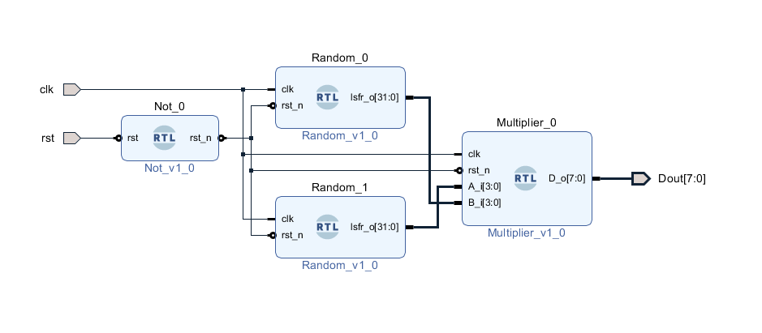

## 01: Random Generator
Platform: Vivado 2019.1  
Simulator: Vivado Simulator  
Language: Verilog  

### Example Block Diagram

### Pseudo-random number generation with linear-feedback shift register(LFSR)

  
I implemented this Feedback Polynomial in a simple random generator module with a parameter SEED.   
You can refer to the reference [1] and [2] for more details.

port | name
-|-
input| clk,rst_n
output| lsfr_o

Random #(.SEED(32'h8456CAD7) ) instance( .clk(clk), .rst_n(rst_n), .lsfr_o(rand) );

### Refrence:

[1]:  [FPGA Implementation of 8, 16 and 32 Bit LFSR with Maximum Length Feedback Polynomial using VHDL](https://ieeexplore.ieee.org/document/6200740) 

[2]: [Wiki: Linear-feedback shift register](https://en.wikipedia.org/wiki/Linear-feedback_shift_register) 
