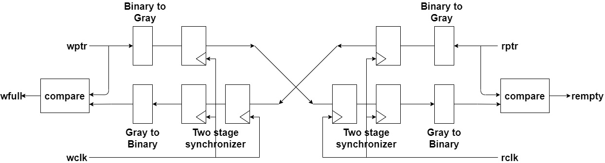
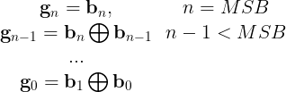
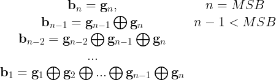

## 01: Asynchronize FIFO
Platform: Vivado 2019.1  
Simulator: Vivado Simulator  
Language: Verilog  

### FIFO block diagram

### testing environment

### module description

##### 1. Producer
- controls winc, wdata to Async_FIFO mopdule. 
- wdata is a up counter start from 1.
##### 2. Reciever
- controls rinc to Async_FIFO mopdule. 
- checks whether the rdata read from FIFO is correct.(compared rdata with recieve counter)
##### 3. Async_FIFO
- recieves wdata from Producer.
- sends rdata to Receiver.
##### 4. FIFO_MEM
- a simple dual port memory
- wirte port: provides synchrous write at the wclk's posedge.
- read port: provides asynchrous read 

### implementation details

##### 1. binary2gray [1]

##### 2. gray2binary [2]

##### 3. comparison [3]
- I extend one more bit on the pointer. By comaring the first bit and the rest four bits of the two pointer, the system can simply determines wfull and rempty signals. 
- For example, when the write pointer counts to 5'b10000 and the read pointer counts to 5'b00000, the FIFO is full. It can be calculated by:
- wfull = ( {~wptr[4],wptr[3:0]}, rptr )? 1 : 0;
- rempty = ( wptr, rptr )? 1 : 0;

### discussion

1.Why use gray code counter in Asynchronous FIFO?
- if the counter changes more than one bit in the next clock, the output of synchronizer may occur unexpected output in the switch process. This unexpected output may cause error in wfull or rempty signals.
- For example, if counter changes from 101 -> 110, the output of synchronizer may switch like 101-> 111 -> 110 in a very short period. 

2.How to design a FIFO if FIFO depth is not power of 2?
- Formula to calculate gray code counter with a fifo depth which is not power of 2.
 
- to be done

3.what is the purpose of already_wfull and already_rempty signals?
- to be done

### Refrence:

[1]: [Conversion of Binary to Gray Code](https://www.tutorialspoint.com/conversion-of-binary-to-gray-code)
[2]: [Conversion of Gray Code to Binary](https://www.tutorialspoint.com/conversion-of-gray-code-to-binary)
[3]: [What is Asynchronous FIFO? || Asynchronous FIFO DESIGN (Clock Domain crossing) Explained in detail.](https://www.youtube.com/watch?v=0LVHPRmi88c)
