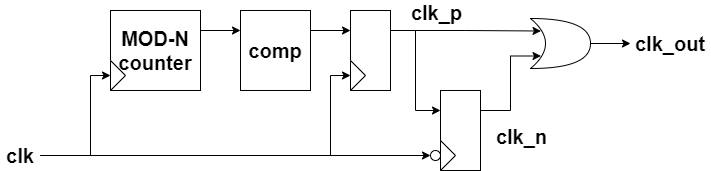
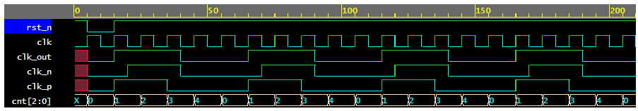

# Clock divider

Language: Verilog   
Platform: EDAplayground  
Simulator: Synopsys VCS 2020.3
[-> code on EDAplayground](https://www.edaplayground.com/x/QVTV)

### block diagram

### waveform
Clock divided by 5 (parameter N=5).

