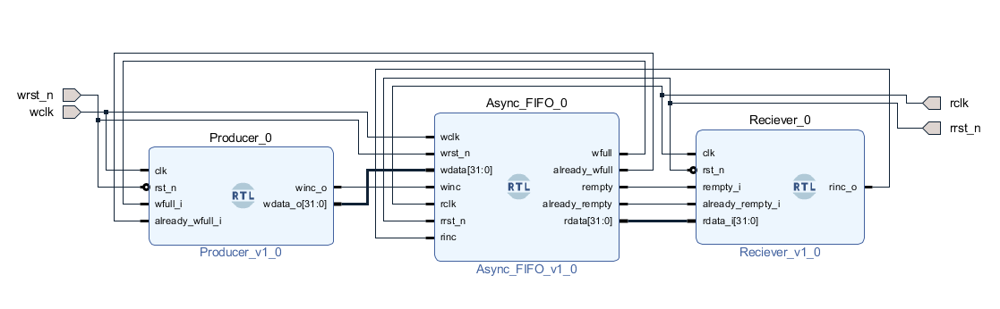
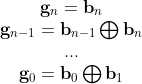

# 01: Asynchronous FIFO
Language: Verilog 
Platform: **EDAplayground** or Vivado 
Simulator: **Synopsys VCS 2020.3** or Vivado Simulator   

[-> Code on EDAplayground](https://www.edaplayground.com/x/dQzx)

# FIFO block diagram

# testing environment

# module description

### 1. Producer
- controls **winc**, **wdata** to Async_FIFO module. 
- **wdata** is an up counter start from 1.
### 2. Receiver
- controls **rinc** to Async_FIFO module. 
- checks whether the **rdata** read from FIFO is correct.(compared **rdata** with receive counter)
### 3. Async_FIFO
- receives **wdata** from producer module.
- sends **rdata** to receiver module.
### 4. FIFO_MEM
- a simple dual-port memory
- write port: provides synchronous write at the posedge of **wclk**.
- read port: provides asynchronous read 

# implementation details

### 1. binary2gray [[1]](#Reference)

### 2. gray2binary [[2]](#Reference)

### 3. comparison [[3]](#Reference)
- I extend one more bit on the pointer. By comparing the first bit and the rest four bits of the two pointer, the system can simply determine **wfull** and **rempty** signals. 
- For example, when the write pointer counts to 5'b10000 and the read pointer counts to 5'b00000, the FIFO is full. It can be calculated by:
- assign **wfull** = ( {~wptr[4],wptr[3:0]}, rptr )? 1 : 0;
- assign **rempty** = ( wptr, rptr )? 1 : 0;

### 4. FIFO depth (not power of 2) [[3]](#Reference)
- To design a gray counter which is not power of 2, we need to make gray counter's start count is only one bit different with end count. 
- Here is the formula to calculate.

- For example, I set the FIFO depth equal to 10 in my design. The binary cpunter counts from 3 to 12 (from 2^4 - 10/2 to 2^4 - 10/2 +1). Thus, the gray code counts from 0010 to 1010. Then, counter inverts wptr[4] and repeat to 0010.
- assign wptr_next = (wptr[3:0] >= 4'd12)? {~wptr[4],4'd3}: wptr+1;

decimal | binary | gray
-|-|-
3| 0011 | 0010
4| 0100 | 0110
5 | 0101 | 0111
6 | 0110 | 0101
7 | 0111 | 0100
8 | 1000 | 1100
9 | 1001 | 1101
10 | 1010 | 1111
11 | 1011 | 1110
12 | 1100 | 1010

# discussion

1.Why use the gray code counter in Asynchronous FIFO?
- if the counter changes more than one bit in the next clock, the synchronizer's output may occur unexpected output in the switching process. This unexpected output may cause an error in **wfull** or **rempty** signals.
- For example, if the counter changes from 101 -> 110, the synchronizer's output may switch like 101-> 111 -> 110 in a concise period. 

2.what is the purpose of already_wfull and already_rempty signals?
- already signals can help master control **wdata** with less logic.
- When the producer receives an **wfull** signal, it needs to wait until FIFO is not full and reproduces the previous **wdata**. If the producer does not reproduce the **wdata**, FIFO will miss the **wdata** as the first waveform.

- But if the producer receives an **already_wfull** signal, it just needs to wait until FIFO is not already full. The producer does not need to reproduce the previous **wdata**.

# Reference

[1]: [Conversion of Binary to Gray Code](https://www.tutorialspoint.com/conversion-of-binary-to-gray-code)  
[2]: [Conversion of Gray Code to Binary](https://www.tutorialspoint.com/conversion-of-gray-code-to-binary)  
[3]: [What is Asynchronous FIFO? || Asynchronous FIFO DESIGN (Clock Domain crossing) Explained in detail.](https://www.youtube.com/watch?v=0LVHPRmi88c)  
